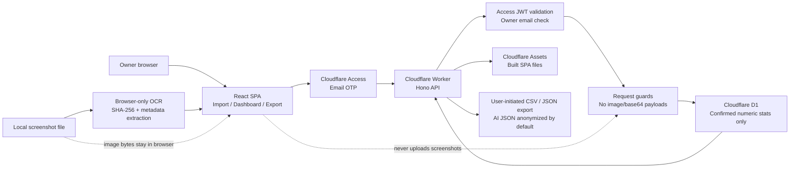

# TileLog Lens

Unofficial, personal-use, post-game statistics tracker for Mahjong Soul / 雀魂 screenshots.

TileLog Lens lets you record cumulative statistics snapshots, analyze trends, and export CSV/JSON for AI-assisted review. It is designed for **private post-game record keeping only**.

## What this app does

- Records confirmed numerical statistics from your own post-game/profile statistics screenshots.
- Requires observation date and `HH:mm` time for every snapshot.
- Runs optional browser-side OCR to prefill known statistics fields from a local screenshot.
- Supports East, South, three-player, and other game modes.
- Stores numerical data in Cloudflare D1.
- Shows trend charts and estimated period deltas.
- Shows recent-period performance differences and improvement priority scores.
- Exports CSV for spreadsheet analysis.
- Exports AI-friendly JSON for external analysis.
- Uses Cloudflare Access email One-time PIN / OTP for owner-only login.
- Includes a Settings page for owner info and basic configuration.

## What this app does not do

- It does not store screenshots server-side.
- It does not modify the game client.
- It does not inspect network traffic.
- It does not automate gameplay.
- It does not provide real-time in-game advice.
- It does not use official logos, characters, or copyrighted assets in the app UI.
- It is not affiliated with Yostar or Mahjong Soul / 雀魂.

## Disclaimer

This application is an unofficial personal statistics tracker for Mahjong Soul / 雀魂.

It is designed only for post-game personal record keeping. It does not modify the game client, inspect network traffic, automate gameplay, or provide real-time in-game assistance.

Screenshots are processed locally in the browser and are not stored on the server. Only manually confirmed numerical statistics are saved.

日本語:

本アプリは「雀魂」の非公式・個人用戦績記録ツールです。

対局中の判断補助、ゲームクライアントの改変、通信解析、自動操作、リアルタイム支援を目的としません。

スクリーンショット画像はブラウザ内でのみ処理し、サーバーには保存しません。保存されるのは、ユーザーが確認した戦績数値のみです。

## Stack

- React SPA
- Vite
- TypeScript
- Hono
- Cloudflare Workers
- Cloudflare D1
- Cloudflare Access email One-time PIN / OTP
- Zod
- jose
- Vitest

## System architecture



Screenshots are processed only in the browser. API requests carry confirmed
statistics and optional image metadata such as hash, dimensions, and file name,
but never screenshot images or base64 payloads.

## Recommended repository structure

```txt
.
├─ migrations/
│  └─ 0001_init.sql
├─ src/
│  ├─ worker/
│  ├─ web/
│  └─ shared/
├─ tests/
├─ AGENTS.md
├─ DESIGN.md
├─ PLAN.md
├─ README.md
└─ SPEC.md
```

## Environment variables and bindings

Expected Worker environment:

```ts
interface Env {
  DB: D1Database;
  ENVIRONMENT: "development" | "preview" | "production";
  OWNER_EMAIL: string;
  ACCESS_AUD: string;
  ACCESS_ISSUER: string;
  ACCESS_JWKS_URL: string;
}
```

Example `wrangler.jsonc` fragment:

```jsonc
{
  "name": "tilelog-lens",
  "main": "src/worker/index.ts",
  "compatibility_date": "2026-06-01",
  "workers_dev": false,
  "d1_databases": [
    {
      "binding": "DB",
      "database_name": "tilelog_lens",
      "database_id": "<database-id>"
    }
  ],
  "vars": {
    "ENVIRONMENT": "production",
    "ACCESS_ISSUER": "https://<team-name>.cloudflareaccess.com",
    "ACCESS_JWKS_URL": "https://<team-name>.cloudflareaccess.com/cdn-cgi/access/certs"
  }
}
```

Set secrets:

```bash
wrangler secret put OWNER_EMAIL
wrangler secret put ACCESS_AUD
```

## Configuration visibility

`wrangler.jsonc` may contain deployment-specific identifiers such as the D1 database ID, production hostname, and Cloudflare Access issuer/JWKS URL.

These values are not application secrets by themselves, but they reveal deployment metadata. For a public repository, review whether you want to keep them committed or replace them with placeholders.

Never commit:

- `OWNER_EMAIL`
- `ACCESS_AUD`
- API tokens
- Cloudflare account tokens
- any private keys or credentials

## Cloudflare Access setup summary

1. Open Cloudflare Zero Trust.
2. Create a self-hosted Access application for the production hostname.
3. Enable One-time PIN / OTP login.
4. Create an Allow policy.
5. Include only your owner email address.
6. Do not add `Everyone`, broad domains, or bypass policies.
7. Confirm the application audience tag and set it as `ACCESS_AUD`.
8. Set `ACCESS_ISSUER` and `ACCESS_JWKS_URL` for JWT validation.
9. Disable `workers_dev` in production, or protect workers.dev with Access too.

Current intended production hostname:

```txt
tilelog-lens.hamakyo.dev
```

The Worker route is configured for that hostname. Create a proxied DNS record
for `tilelog-lens.hamakyo.dev` in Cloudflare DNS before expecting the hostname
to resolve.

Until Cloudflare Access is configured and `ACCESS_AUD`, `ACCESS_ISSUER`, and
`ACCESS_JWKS_URL` are set correctly, the Worker rejects requests without a
valid Access JWT.

## Local development

Commands:

```bash
pnpm install
pnpm run typecheck
pnpm test
pnpm run build
```

For local D1:

```bash
wrangler d1 create tilelog_lens
pnpm run db:migrate:local
pnpm run dev
```

For remote D1:

```bash
wrangler d1 migrations apply tilelog_lens --remote
```

## D1 backup and restore

Create a remote D1 SQL backup before applying remote migrations or making risky
data changes:

```bash
pnpm run db:backup:remote
```

The command writes `backups/tilelog_lens-remote-latest.sql`. Files under
`backups/*.sql` are intentionally gitignored because they may contain personal
stats, notes, player identifiers, and source metadata.

For a timestamped backup, run:

```bash
mkdir -p backups
wrangler d1 export tilelog_lens --remote --skip-confirmation --output "backups/tilelog_lens-remote-$(date -u +%Y%m%dT%H%M%SZ).sql"
```

Restore into local D1 first and inspect the app before restoring remote data:

```bash
wrangler d1 execute tilelog_lens --local --file backups/tilelog_lens-remote-latest.sql
pnpm run dev
```

Remote restore is intentionally manual:

```bash
wrangler d1 execute tilelog_lens --remote --file backups/tilelog_lens-remote-latest.sql
```

Only run remote restore after confirming the target database and backup file.
Do not commit backups.

Deploy:

```bash
pnpm run deploy
```

## Continuous integration

GitHub Actions runs the main verification suite on pushes to `main` and pull
requests:

```bash
pnpm run typecheck
pnpm test
pnpm run build
pnpm run test:e2e
```

The E2E suite uses synthetic image fixtures only and verifies mobile import,
local metadata extraction, safe API payload shape, required `HH:mm`, and export
link reachability.

## MVP usage flow

1. Login through Cloudflare Access email OTP.
2. Open Import page.
3. Enter observation date and required `HH:mm` time.
4. Optionally select a local screenshot for browser-only preview/OCR.
5. Run OCR if desired, then confirm or manually edit all statistics.
6. Save snapshot to D1.
7. View trend dashboard.
8. Download CSV or anonymized AI JSON.
9. Open Settings to review owner info or export options.

## Data model summary

The main table is `stat_snapshots`.

It stores:

- observation datetime
- game mode
- rank data
- match count
- placement rates
- win/deal-in/call/riichi rates
- optional notes
- optional source image hash
- optional source metadata

MVP stores one optional note directly on `stat_snapshots.note`. A separate
`play_notes` table is reserved for future richer note-taking features and is
not part of the initial migration.

It does not store:

- image bytes
- base64 screenshots
- screenshot URLs
- official assets

## Export behavior

CSV/JSON files are generated on demand from D1 and returned as download responses. They are not stored server-side.

Default AI JSON export anonymizes player identifiers and includes:

- metrics description
- snapshots
- derived metrics
- estimated deltas
- analysis request
- privacy metadata showing screenshots are not included

## Privacy notes

- Keep the app private behind Cloudflare Access.
- Do not put sensitive personal information in notes unless you intend to export it.
- Review exported JSON/CSV before uploading to third-party AI tools.
- Use anonymized export by default.

## Security notes

- Validate Access JWT in the Worker.
- Allow only `OWNER_EMAIL`.
- Reject image/base64 payloads in API requests.
- Keep OCR text and screenshots in the browser; do not send them to the API.
- Keep request body limits small.
- Do not log JWTs, notes, player IDs, or export payloads.
- Worker error logs are structured and limited to event, method, path, error
  type/message, and non-sensitive identifiers such as snapshot id.
- Keep `workers_dev` disabled in production unless separately protected.

## Known limitations

- OCR uses fixed crop regions and may require manual correction.
- Crop-region calibration UI is not yet implemented.
- No CSV import for bulk loading historical data.
- PWA / offline mode is not implemented.
- Dark mode is not implemented.

## Official documentation references

- Cloudflare Access One-time PIN: https://developers.cloudflare.com/cloudflare-one/integrations/identity-providers/one-time-pin/
- Cloudflare Access JWT validation: https://developers.cloudflare.com/cloudflare-one/access-controls/applications/http-apps/authorization-cookie/validating-json/
- Cloudflare D1 with Hono: https://developers.cloudflare.com/d1/examples/d1-and-hono/
- Hono on Cloudflare Workers: https://hono.dev/docs/getting-started/cloudflare-workers

## License

Choose a license before publishing. For private personal use, no public license is required. If publishing the repository, MIT is a reasonable default, but do not include any Mahjong Soul / 雀魂 assets.
