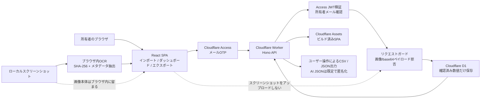

# TileLog Lens

TileLog Lens は、雀魂 / Mahjong Soul の対局後スクリーンショットから確認した数値を記録する、非公式・個人利用向けの戦績トラッカーです。

累積戦績のスナップショットを保存し、傾向分析、期間差分、CSV/JSONエクスポートを行えます。用途は **対局後の個人記録** に限定しています。

## このアプリでできること

- 自分の対局後・プロフィール戦績スクリーンショットから確認した数値を記録します。
- すべての記録で観測日と `HH:mm` 形式の時刻を必須にします。
- ローカルスクリーンショットに対して、ブラウザ内だけで任意のOCRを実行します。
- 東風戦、半荘戦、三人戦、その他のゲームモードに対応します。
- 確認済みの数値データを Cloudflare D1 に保存します。
- トレンドチャート、推定期間差分、直近期の成績差分を表示します。
- 改善優先度スコアを表示します。
- 表計算向けCSVをエクスポートします。
- 外部AI分析に渡しやすいJSONをエクスポートします。
- Cloudflare Access のメールOTPで所有者だけがログインできます。
- 設定ページで所有者情報や基本設定を確認できます。

## このアプリでしないこと

- スクリーンショット画像をサーバー側に保存しません。
- ゲームクライアントを改変しません。
- 通信内容を解析しません。
- 対局を自動化しません。
- 対局中のリアルタイム助言を提供しません。
- アプリUIに公式ロゴ、キャラクター、著作物アセットを使用しません。
- Yostar または Mahjong Soul / 雀魂 との公式な関係を示しません。

## 免責事項

本アプリは、雀魂 / Mahjong Soul の非公式・個人用戦績記録ツールです。

対局後の個人記録だけを目的としており、ゲームクライアントの改変、通信解析、自動操作、リアルタイム支援は行いません。

スクリーンショット画像はブラウザ内でのみ処理し、サーバーには保存しません。保存されるのは、ユーザーが確認した戦績数値と任意の画像メタデータだけです。

## 技術スタック

- React SPA
- Vite
- TypeScript
- Hono
- Cloudflare Workers
- Cloudflare D1
- Cloudflare Access email One-time PIN / OTP
- Zod
- jose
- Vitest

## システム構成



スクリーンショットはブラウザ内だけで処理します。APIリクエストには、確認済みの戦績数値と、必要に応じてハッシュ・画像サイズ・ファイル名などのメタデータだけを含めます。スクリーンショット画像やbase64ペイロードは送信しません。

## 推奨リポジトリ構成

```txt
.
├─ migrations/
│  └─ 0001_init.sql
├─ src/
│  ├─ worker/
│  ├─ web/
│  └─ shared/
├─ tests/
├─ AGENTS.md
├─ DESIGN.md
├─ PLAN.md
├─ README.md
└─ SPEC.md
```

## 環境変数とバインディング

Worker が想定する環境は次の通りです。

```ts
interface Env {
  DB: D1Database;
  ENVIRONMENT: "development" | "preview" | "production";
  OWNER_EMAIL: string;
  ACCESS_AUD: string;
  ACCESS_ISSUER: string;
  ACCESS_JWKS_URL: string;
}
```

`wrangler.jsonc` の例です。

```jsonc
{
  "name": "tilelog-lens",
  "main": "src/worker/index.ts",
  "compatibility_date": "2026-06-01",
  "workers_dev": false,
  "d1_databases": [
    {
      "binding": "DB",
      "database_name": "tilelog_lens",
      "database_id": "<database-id>"
    }
  ],
  "vars": {
    "ENVIRONMENT": "production",
    "ACCESS_ISSUER": "https://<team-name>.cloudflareaccess.com",
    "ACCESS_JWKS_URL": "https://<team-name>.cloudflareaccess.com/cdn-cgi/access/certs"
  }
}
```

Secrets は次のように設定します。

```bash
wrangler secret put OWNER_EMAIL
wrangler secret put ACCESS_AUD
```

## 設定情報の扱い

`wrangler.jsonc` には、D1 database ID、本番ホスト名、Cloudflare Access issuer/JWKS URL など、デプロイ固有の識別子が含まれる場合があります。

これらは単体ではアプリケーション秘密情報ではありませんが、デプロイ構成のメタデータです。公開リポジトリにする場合は、コミットしたままにするかプレースホルダーへ置き換えるかを確認してください。

次の値はコミットしないでください。

- `OWNER_EMAIL`
- `ACCESS_AUD`
- APIトークン
- Cloudflareアカウントトークン
- 秘密鍵や認証情報

## Cloudflare Access 設定概要

1. Cloudflare Zero Trust を開きます。
2. 本番ホスト名用の self-hosted Access application を作成します。
3. One-time PIN / OTP ログインを有効にします。
4. Allow policy を作成します。
5. 所有者のメールアドレスだけを許可対象にします。
6. `Everyone`、広すぎるドメイン、bypass policy は追加しません。
7. Application audience tag を確認し、`ACCESS_AUD` として設定します。
8. JWT検証用に `ACCESS_ISSUER` と `ACCESS_JWKS_URL` を設定します。
9. 本番では `workers_dev` を無効にするか、workers.dev も Access で保護します。

現在想定している本番ホスト名は次の通りです。

```txt
tilelog-lens.hamakyo.dev
```

Worker route はこのホスト名向けに設定されています。ホスト名でアクセスするには、Cloudflare DNS で `tilelog-lens.hamakyo.dev` の proxied DNS record を作成してください。

Cloudflare Access が設定され、`ACCESS_AUD`、`ACCESS_ISSUER`、`ACCESS_JWKS_URL` が正しく設定されるまでは、有効な Access JWT がないリクエストを Worker が拒否します。

## ローカル開発

基本コマンドです。

```bash
pnpm install
pnpm run typecheck
pnpm test
pnpm run build
```

ローカルD1を使う場合:

```bash
wrangler d1 create tilelog_lens
pnpm run db:migrate:local
pnpm run dev
```

リモートD1にマイグレーションを適用する場合:

```bash
wrangler d1 migrations apply tilelog_lens --remote
```

## D1バックアップと復元

リモートマイグレーションやリスクのあるデータ変更の前に、リモートD1のSQLバックアップを作成します。

```bash
pnpm run db:backup:remote
```

このコマンドは `backups/tilelog_lens-remote-latest.sql` を出力します。`backups/*.sql` は、個人戦績、メモ、プレイヤー識別子、ソースメタデータを含む可能性があるため、意図的にgitignoreしています。

タイムスタンプ付きバックアップを作成する場合:

```bash
mkdir -p backups
wrangler d1 export tilelog_lens --remote --skip-confirmation --output "backups/tilelog_lens-remote-$(date -u +%Y%m%dT%H%M%SZ).sql"
```

復元はまずローカルD1で試し、アプリの表示を確認してからリモートに適用してください。

```bash
wrangler d1 execute tilelog_lens --local --file backups/tilelog_lens-remote-latest.sql
pnpm run dev
```

リモート復元は意図的に手動操作にしています。

```bash
wrangler d1 execute tilelog_lens --remote --file backups/tilelog_lens-remote-latest.sql
```

リモート復元は、対象データベースとバックアップファイルを確認してから実行してください。バックアップファイルはコミットしないでください。

## デプロイ

```bash
pnpm run deploy
```

## 継続的インテグレーション

GitHub Actions は `main` へのpushとpull requestで主要な検証を実行します。

```bash
pnpm run typecheck
pnpm test
pnpm run build
pnpm run test:e2e
```

E2Eテストは合成画像フィクスチャだけを使用し、モバイルインポート、ローカルメタデータ抽出、安全なAPIペイロード形状、必須 `HH:mm`、エクスポートリンク到達性を検証します。

## 基本利用フロー

1. Cloudflare Access のメールOTPでログインします。
2. インポートページを開きます。
3. 観測日と必須の `HH:mm` 時刻を入力します。
4. 必要に応じてローカルスクリーンショットを選択し、ブラウザ内プレビュー/OCRを使います。
5. OCR結果を確認し、必要な項目を手動で修正します。
6. スナップショットをD1に保存します。
7. ダッシュボードで傾向を確認します。
8. CSVまたは匿名化済みAI JSONをダウンロードします。
9. 設定ページで所有者情報やエクスポート設定を確認します。

## データモデル概要

主テーブルは `stat_snapshots` です。

保存する主なデータ:

- 観測日時
- ゲームモード
- 段位情報
- 対戦数
- 順位率
- 和了率、放銃率、副露率、立直率
- 任意メモ
- 任意のソース画像ハッシュ
- 任意のソースメタデータ

MVPでは、任意メモを `stat_snapshots.note` に直接保存します。より詳細なメモ機能向けの `play_notes` テーブルは将来用に予約しており、初期マイグレーションには含めていません。

保存しないデータ:

- 画像バイト列
- base64スクリーンショット
- スクリーンショットURL
- 公式アセット

## エクスポート動作

CSV/JSONファイルは、D1からオンデマンドで生成し、ダウンロードレスポンスとして返します。サーバー側には保存しません。

デフォルトのAI JSONエクスポートはプレイヤー識別子を匿名化し、次の内容を含みます。

- 指標説明
- スナップショット
- 派生指標
- 推定差分
- 分析リクエスト
- スクリーンショットが含まれないことを示すプライバシーメタデータ

## プライバシー注意事項

- アプリは Cloudflare Access の背後で非公開にしてください。
- エクスポートする意図がない限り、メモ欄に機微な個人情報を入れないでください。
- JSON/CSVを第三者AIツールへアップロードする前に内容を確認してください。
- 既定では匿名化エクスポートを使用してください。

## セキュリティ注意事項

- Workerで Access JWT を検証します。
- `OWNER_EMAIL` だけを許可します。
- APIリクエスト内の画像/base64ペイロードを拒否します。
- OCRテキストとスクリーンショットはブラウザ内に留め、APIへ送信しません。
- リクエストボディ制限は小さく保ちます。
- JWT、メモ、プレイヤーID、エクスポートペイロードをログに出力しません。
- Workerのエラーログは、イベント、メソッド、パス、エラー種別/メッセージ、snapshot id などの非機微な識別子に限定します。
- 本番では、別途保護しない限り `workers_dev` を無効にします。

## 既知の制限

- OCRは固定クロップ領域を使うため、手動修正が必要な場合があります。
- クロップ領域のキャリブレーションUIは未実装です。
- 過去データ一括投入用のCSVインポートは未実装です。
- PWA / オフラインモードは未実装です。
- ダークモードは未実装です。

## 公式ドキュメント参照

- Cloudflare Access One-time PIN: https://developers.cloudflare.com/cloudflare-one/integrations/identity-providers/one-time-pin/
- Cloudflare Access JWT validation: https://developers.cloudflare.com/cloudflare-one/access-controls/applications/http-apps/authorization-cookie/validating-json/
- Cloudflare D1 with Hono: https://developers.cloudflare.com/d1/examples/d1-and-hono/
- Hono on Cloudflare Workers: https://hono.dev/docs/getting-started/cloudflare-workers

## ライセンス

公開前にライセンスを選択してください。個人利用の非公開リポジトリであれば、公開ライセンスは必須ではありません。リポジトリを公開する場合はMITが無難ですが、Mahjong Soul / 雀魂のアセットは含めないでください。
